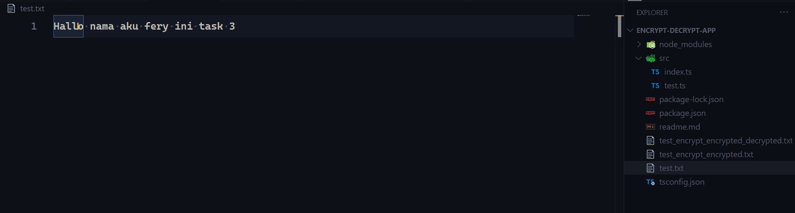
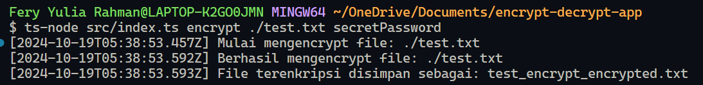
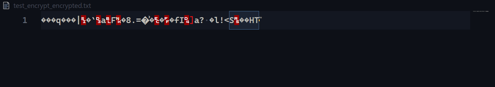
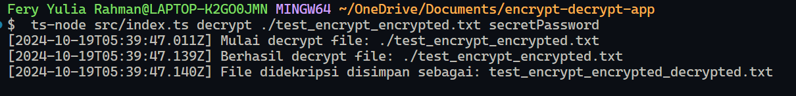
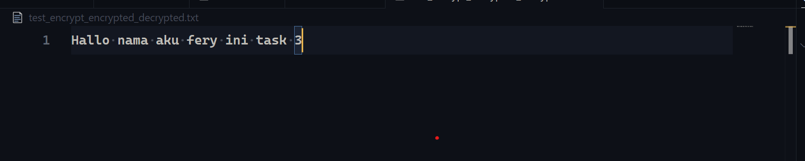

## Encrypt file

- file "test.txt"
  
- Membuat encrypt dari file test.txt yang sudah di buat

```
 ts-node src/index.ts encrypt ./test.txt secretPassword
```



- lalu akan membuat file bernama "test_encrypt_encrypted.txt" yang dimana adalah hasil encrypt dari kalimat yang ada di file test.txt
  

## Decrypt file

- Lalu jika ingin melakukan decrypt dari file "test_encrypt_encrypted.txt", jalankan saja command dibawah ini dan arahkan ke file yang ter encrypt tadi

```
 ts-node src/index.ts decrypt ./test_encrypt_encrypted.txt secretPassword
```



- Lalu jika berhasil maka akan ada file bernama "test_encrypt_encrypted_decrypted.txt" yang isi nya dari encrypt tadi dan file tersebut akan sama isinya dengan file "test.txt"
  
